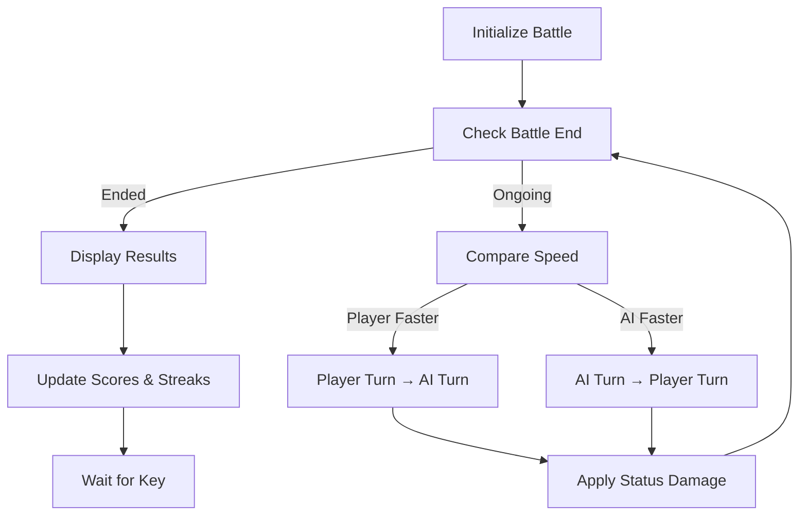
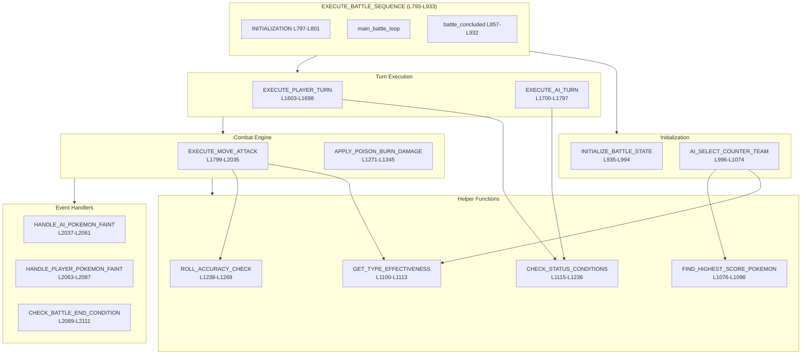
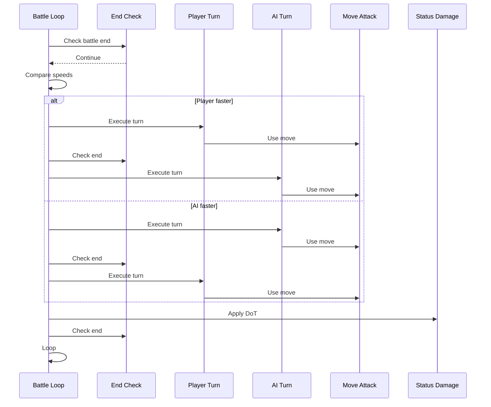

# PokéBattle 8086 - Battle System Documentation

## Features 3 & 4: Turn-Based Battle Engine & Move System with Type Effectiveness

**Author:** Farhan Zarif (23301692)  
**File:** `PokeBattle8086.asm`  
**Generated:** January 6, 2026

---

## Table of Contents

1. [Overview](#overview)
2. [Procedure Reference Table](#procedure-reference-table)
3. [Main Battle Loop](#1-execute_battle_sequence-l793-l933)
4. [Battle Initialization](#2-initialize_battle_state-l935-l994)
5. [AI Team Selection](#3-ai_select_counter_team-l996-l1074)
6. [Helper: Find Highest Score](#4-find_highest_score_pokemon-l1076-l1098)
7. [Helper: Type Effectiveness](#5-get_type_effectiveness-l1100-l1113)
8. [Status Condition Check](#6-check_status_conditions-l1115-l1236)
9. [Accuracy Roll](#7-roll_accuracy_check-l1238-l1269)
10. [Poison/Burn Damage](#8-apply_poison_burn_damage-l1271-l1345)
11. [Player Turn Execution](#9-execute_player_turn-l1603-l1698)
12. [AI Turn Execution](#10-execute_ai_turn-l1700-l1797)
13. [Move Attack Engine](#11-execute_move_attack-l1799-l2035)
14. [AI Faint Handler](#12-handle_ai_pokemon_faint-l2037-l2061)
15. [Player Faint Handler](#13-handle_player_pokemon_faint-l2063-l2087)
16. [Battle End Check](#14-check_battle_end_condition-l2089-l2111)
17. [Complete System Integration](#complete-system-integration)

---

## Overview

This document provides a comprehensive analysis of the battle system implementation in PokéBattle 8086, an 8086 assembly language Pokémon-style battle game. The system implements:

- **Turn-based combat** with speed-based turn order
- **Type effectiveness** system (super effective, not effective, normal)
- **Status conditions** (poison, burn, sleep, paralysis, rest)
- **Critical hit** mechanics (1/16 chance)
- **AI opponent** with strategic counter-picking and healing logic

---

## Procedure Reference Table

| Procedure | Lines | Purpose |
|-----------|-------|---------|
| `EXECUTE_BATTLE_SEQUENCE` | L793-L933 | Master battle controller |
| `INITIALIZE_BATTLE_STATE` | L935-L994 | Setup HP, PP, status |
| `AI_SELECT_COUNTER_TEAM` | L996-L1074 | AI team selection |
| `FIND_HIGHEST_SCORE_POKEMON` | L1076-L1098 | Find best counter |
| `GET_TYPE_EFFECTIVENESS` | L1100-L1113 | Type matchup lookup |
| `CHECK_STATUS_CONDITIONS` | L1115-L1236 | Can Pokémon act? |
| `ROLL_ACCURACY_CHECK` | L1238-L1269 | Hit or miss? |
| `APPLY_POISON_BURN_DAMAGE` | L1271-L1345 | DoT damage |
| `EXECUTE_PLAYER_TURN` | L1603-L1698 | Player input handling |
| `EXECUTE_AI_TURN` | L1700-L1797 | AI decision making |
| `EXECUTE_MOVE_ATTACK` | L1799-L2035 | Combat engine |
| `HANDLE_AI_POKEMON_FAINT` | L2037-L2061 | AI faint handler |
| `HANDLE_PLAYER_POKEMON_FAINT` | L2063-L2087 | Player faint handler |
| `CHECK_BATTLE_END_CONDITION` | L2089-L2111 | Victory check |

---

## 1. EXECUTE_BATTLE_SEQUENCE (L793-L933)

### Purpose
The **core battle engine** that manages the entire turn-based combat loop between player and AI opponent.

### Responsibilities
1. Battle initialization
2. Speed-based turn order determination
3. Turn execution for both player and AI
4. Status effects application
5. Win/Loss detection and score tracking

### Pseudocode

```python
def EXECUTE_BATTLE_SEQUENCE():
    # === INITIALIZATION ===
    INITIALIZE_BATTLE_STATE()
    AI_SELECT_COUNTER_TEAM()
    currentPlayerPokemonIndex = 0
    currentAIPokemonIndex = 0
    battleOutcomeFlag = 0  # 0 = ongoing, 1 = player wins, 2 = AI wins

    # === MAIN BATTLE LOOP ===
    while True:
        CHECK_BATTLE_END_CONDITION()
        if battleOutcomeFlag != 0:
            break  # Battle ended

        DRAW_UI()

        # --- SPEED COMPARISON ---
        playerPokemon = playerTeamIndices[currentPlayerPokemonIndex]
        playerSpeed = pSpeed[playerPokemon]
        aiPokemon = aiTeamIndices[currentAIPokemonIndex]
        aiSpeed = pSpeed[aiPokemon]

        if playerSpeed >= aiSpeed:
            # PLAYER ACTS FIRST
            savedAIIndex = currentAIPokemonIndex
            EXECUTE_PLAYER_TURN()
            CHECK_BATTLE_END_CONDITION()
            if battleOutcomeFlag != 0:
                break
            if savedAIIndex != currentAIPokemonIndex:
                continue
            
            EXECUTE_AI_TURN()
            APPLY_POISON_BURN_DAMAGE()
            CHECK_BATTLE_END_CONDITION()
        else:
            # AI ACTS FIRST
            savedPlayerIndex = currentPlayerPokemonIndex
            EXECUTE_AI_TURN()
            CHECK_BATTLE_END_CONDITION()
            if battleOutcomeFlag != 0:
                break
            if savedPlayerIndex != currentPlayerPokemonIndex:
                continue

            DRAW_UI()
            EXECUTE_PLAYER_TURN()
            APPLY_POISON_BURN_DAMAGE()
            CHECK_BATTLE_END_CONDITION()

    # === BATTLE CONCLUSION ===
    if battleOutcomeFlag == 1:  # Player won
        playerScore += 1
        winStreak += 1
        bestStreak = max(bestStreak, winStreak)
    else:  # Player lost
        aiScore += 1
        winStreak = 0
    
    roundCount += 1
    display_results()
```

### Key Formula: Speed Comparison
```
if playerSpeed >= aiSpeed:
    player_goes_first = True
else:
    ai_goes_first = True
```

### Flow Diagram



---

## 2. INITIALIZE_BATTLE_STATE (L935-L994)

### Purpose
Prepares all battle data before combat begins, initializing HP, PP, status conditions, and determining AI availability.

### Responsibilities
1. Convert player's selection from character format to numeric indices
2. Initialize player Pokémon stats (HP, PP, flags)
3. Mark unavailable Pokémon for AI
4. Reset all status conditions

### Pseudocode

```python
def INITIALIZE_BATTLE_STATE():
    # === PHASE 1: Convert Selection Characters to Indices ===
    for i in range(3):
        playerTeamIndices[i] = selectedArray[i] - '1'

    # === PHASE 2: Initialize Player Pokémon Stats ===
    for i in range(3):
        pokemonIndex = playerTeamIndices[i]
        playerCurrentHP[i] = pMaxHP[pokemonIndex]
        playerMaximumHP[i] = pMaxHP[pokemonIndex]
        playerHealUsed[i] = 0
        playerRechargeFlag[i] = 0
        
        # Copy PP for all 4 moves
        moveBaseIndex = pokemonIndex * 4
        ppBaseIndex = i * 4
        for j in range(4):
            playerMovePP[ppBaseIndex + j] = mPPMax[moveBaseIndex + j]

    # === PHASE 3: Mark AI Pokémon Availability ===
    aiPokemonAvailable = [1, 1, 1, 1, 1, 1]  # All available
    for i in range(3):
        pokemonIndex = playerTeamIndices[i]
        aiPokemonAvailable[pokemonIndex] = 0  # AI can't pick this

    # === PHASE 4: Reset All Status Conditions ===
    playerStatusCondition = [0, 0, 0]
    aiStatusCondition = [0, 0, 0]
    playerStatusDuration = [0, 0, 0]
    aiStatusDuration = [0, 0, 0]
```

### Key Formula: ASCII to Index
```
index = ASCII_char - '1'
# '1' → 0, '2' → 1, '3' → 2
```

### Key Formula: PP Array Indexing
```python
moveBaseIndex = pokemonIndex * 4
ppBaseIndex = teamSlot * 4
# Each Pokémon has 4 moves
```

---

## 3. AI_SELECT_COUNTER_TEAM (L996-L1074)

### Purpose
Implements the AI's strategic team selection algorithm, analyzing the player's team and picking the 3 best counter-Pokémon based on type advantage scoring.

### Responsibilities
1. Score each available Pokémon based on type effectiveness
2. Select the top 3 highest-scoring Pokémon
3. Initialize AI Pokémon stats

### Pseudocode

```python
def AI_SELECT_COUNTER_TEAM():
    # === PHASE 1: Score All Available Pokémon ===
    for pokemonIndex in range(6):
        if aiPokemonAvailable[pokemonIndex] == 0:
            continue
        
        totalScore = 0
        for playerSlot in range(3):
            aiType = pType[pokemonIndex]
            playerPokemonIndex = playerTeamIndices[playerSlot]
            playerType = pType[playerPokemonIndex]
            effectiveness = GET_TYPE_EFFECTIVENESS(aiType, playerType)
            totalScore += effectiveness
        
        aiTypeAdvantageScores[pokemonIndex] = totalScore

    # === PHASE 2: Pick Top 3 Scoring Pokémon ===
    for pick in range(3):
        best = FIND_HIGHEST_SCORE_POKEMON()
        aiTeamIndices[pick] = best
        aiPokemonAvailable[best] = 0

    # === PHASE 3: Initialize AI Pokémon Stats ===
    for i in range(3):
        pokemonIndex = aiTeamIndices[i]
        aiCurrentHP[i] = pMaxHP[pokemonIndex]
        aiMaximumHP[i] = pMaxHP[pokemonIndex]
        aiHealUsed[i] = 0
        aiRechargeFlag[i] = 0
        # Copy PP values...
```

### Key Formula: Type Advantage Scoring
```python
total_score = 0
for each player_pokemon in player_team:
    effectiveness = GET_TYPE_EFFECTIVENESS(ai_type, player_type)
    total_score += effectiveness
# Higher score = better counter
```

---

## 4. FIND_HIGHEST_SCORE_POKEMON (L1076-L1098)

### Purpose
Helper function that finds the Pokémon with the highest type advantage score from the remaining available pool.

### Pseudocode

```python
def FIND_HIGHEST_SCORE_POKEMON() -> int:
    bestScore = 0
    bestIndex = 0
    
    for candidateIndex in range(6):
        if aiPokemonAvailable[candidateIndex] == 0:
            continue
        
        currentScore = aiTypeAdvantageScores[candidateIndex]
        if currentScore > bestScore:
            bestScore = currentScore
            bestIndex = candidateIndex
    
    return bestIndex
```

### Algorithm Properties
| Property | Value |
|----------|-------|
| Time Complexity | O(n) where n = 6 |
| Tie-breaking | First maximum wins |

---

## 5. GET_TYPE_EFFECTIVENESS (L1100-L1113)

### Purpose
Lookup function that determines type effectiveness using a 2D matrix stored as a flat 1D array.

### Pseudocode

```python
def GET_TYPE_EFFECTIVENESS(attackerType: int, defenderType: int) -> int:
    # 2D to 1D index conversion
    index = (attackerType * 5) + defenderType
    return typeEffectivenessMatrix[index]
```

### Key Formula: 2D Array Flattening
```
index = row × COLUMNS + column
index = attackerType × 5 + defenderType
```

### Effectiveness Values
| Value | Meaning |
|-------|---------|
| 0 | Not Very Effective (×0.5) |
| 1 | Normal (×1) |
| 2 | Super Effective (×2) |

---

## 6. CHECK_STATUS_CONDITIONS (L1115-L1236)

### Purpose
Checks if a Pokémon can take its turn based on status conditions (sleep, recharge, rest, etc.).

### Input/Output
| Register | Direction | Purpose |
|----------|-----------|---------|
| `bl` | Input | Pokémon slot index (0-2) |
| `cl` | Input | Side flag: 0 = Player, 1 = AI |
| `al` | Output | 1 = can act, 0 = must skip |

### Pseudocode

```python
def CHECK_STATUS_CONDITIONS(slot: int, is_ai: bool) -> bool:
    # Check Recharge Flag
    if rechargeFlag[slot] == 1:
        rechargeFlag[slot] = 0
        print(f"{pokemon} must recharge!")
        return 0  # Skip turn
    
    status = statusCondition[slot]
    
    if status == 0:
        return 1  # Can act
    
    if status == 3:  # REST
        statusCondition[slot] = 0
        print(f"{pokemon} is sleeping...")
        return 0
    
    if status >= 4:  # Poison/Burn
        return 1  # Can act (damage applied elsewhere)
    
    # Sleep (status 1-2)
    statusDuration[slot] -= 1
    if statusDuration[slot] <= 0:
        statusCondition[slot] = 0
        print(f"{pokemon} woke up!")
        return 1
    
    return 0  # Still asleep
```

### Status Codes
| Code | Status | Can Act? |
|------|--------|----------|
| 0 | None | ✓ |
| 1-2 | Sleep | ✗ |
| 3 | Rest | ✗ |
| 4 | Poison | ✓ |
| 5 | Burn | ✓ |

---

## 7. ROLL_ACCURACY_CHECK (L1238-L1269)

### Purpose
Implements a random accuracy check to determine if a move hits or misses.

### Pseudocode

```python
def ROLL_ACCURACY_CHECK(move_index: int) -> bool:
    accuracy = mAccuracy[move_index]
    
    if accuracy == 255:
        return 1  # Always hits
    
    random_roll = (BIOS_timer % 100) + 1  # 1-100
    
    if random_roll <= accuracy:
        return 1  # Hit
    else:
        print("The attack missed!")
        return 0  # Miss
```

### Key Formula
```python
random_roll = (timer_ticks MOD 100) + 1
if random_roll ≤ move_accuracy:
    result = HIT
```

---

## 8. APPLY_POISON_BURN_DAMAGE (L1271-L1345)

### Purpose
Applies damage over time (DoT) from Poison and Burn status effects at the end of each battle turn.

### Pseudocode

```python
def APPLY_POISON_BURN_DAMAGE():
    for side in [player, ai]:
        status = statusCondition[slot]
        
        if status == 4 or status == 5:  # Poison or Burn
            # Calculate damage: 1/8 of max HP
            damage = maxHP[slot] >> 3  # Divide by 8
            
            if damage == 0:
                damage = 1  # Minimum
            
            if damage > currentHP[slot]:
                damage = currentHP[slot]  # Cap
            
            currentHP[slot] -= damage
            print(f"{pokemon} is hurt by status! {damage} DMG")
            
            if currentHP[slot] <= 0:
                HANDLE_POKEMON_FAINT()
```

### Key Formula: Status Damage
```
damage = maxHP ÷ 8  (using shr al, 3)
damage = max(damage, 1)  # Minimum 1
damage = min(damage, currentHP)  # Cap at remaining HP
```

---

## 9. EXECUTE_PLAYER_TURN (L1603-L1698)

### Purpose
Handles the player's turn in battle, processing input and executing the chosen action.

### Input Options
| Key | Action |
|-----|--------|
| 1-4 | Use Move |
| 5 | Heal (+10 HP) |
| 6 | Switch Pokémon |

### Pseudocode

```python
def EXECUTE_PLAYER_TURN():
    if not CHECK_STATUS_CONDITIONS(slot, is_player=True):
        return  # Skip turn
    
    while True:
        key = get_keypress()
        
        if '1' <= key <= '4':
            move_slot = key - '1'
            pp_index = (pokemon_index * 4) + move_slot
            
            if playerMovePP[pp_index] == 0:
                print("Invalid!")
                continue
            
            playerMovePP[pp_index] -= 1
            EXECUTE_MOVE_ATTACK(move_slot)
            return
        
        elif key == '5':  # Heal
            if playerHealUsed[slot] == 1:
                continue
            playerHealUsed[slot] = 1
            playerCurrentHP[slot] = min(playerCurrentHP[slot] + 10, playerMaximumHP[slot])
            return
        
        elif key == '6':  # Switch
            target = get_keypress() - '1'
            if valid_switch(target):
                currentPlayerPokemonIndex = target
                return
```

### Key Formula: Heal
```python
new_hp = min(current_hp + 10, max_hp)
```

---

## 10. EXECUTE_AI_TURN (L1700-L1797)

### Purpose
Handles the AI opponent's turn with decision-making logic for healing vs attacking.

### Decision Logic
| Condition | Action |
|-----------|--------|
| HP ≤ 30% AND heal not used | Heal |
| Otherwise | Random attack |

### Pseudocode

```python
def EXECUTE_AI_TURN():
    if not CHECK_STATUS_CONDITIONS(slot, is_ai=True):
        return
    
    # Calculate 30% HP threshold
    threshold = (aiMaximumHP[slot] * 30) // 100
    
    if aiCurrentHP[slot] <= threshold and not aiHealUsed[slot]:
        # Heal
        aiHealUsed[slot] = 1
        aiCurrentHP[slot] = min(aiCurrentHP[slot] + 10, aiMaximumHP[slot])
    else:
        # Random attack
        while True:
            move_slot = random() % 4
            if aiMovePP[pp_index] > 0:
                break
        
        aiMovePP[pp_index] -= 1
        EXECUTE_MOVE_ATTACK(move_slot, is_ai=True)
```

### Key Formula: 30% Threshold
```
threshold = (maxHP × 30) ÷ 100
```

---

## 11. EXECUTE_MOVE_ATTACK (L1799-L2035)

### Purpose
The core combat engine that executes a move attack, handling type effectiveness, status effects, damage calculation, and critical hits.

### Pseudocode

```python
def EXECUTE_MOVE_ATTACK(move_slot: int, is_ai_attacker: bool):
    move_index = (pokemon_index * 4) + move_slot
    print(f"{attacker} used {move_name}!")
    
    if not ROLL_ACCURACY_CHECK(move_index):
        return  # Missed
    
    if mFlags[move_index] & 0x01:  # Status move
        status_type = mStatusType[move_index]
        
        if status_type == 3:  # REST
            currentHP += maxHP // 2
            statusCondition = 3
            return
        
        # Apply status to target
        if targetStatusCondition == 0:
            targetStatusCondition = status_type
            targetStatusDuration = 3
        return
    
    # Damage calculation
    damage = mPower[move_index]
    effectiveness = GET_TYPE_EFFECTIVENESS(move_type, defender_type)
    
    if effectiveness == 2:
        damage *= 2
        print("It's super effective!")
    elif effectiveness == 0:
        damage = max(damage // 2, 1)
        print("It's not very effective...")
    
    # Critical hit (1/16 chance)
    if (random() & 0x0F) == 0:
        damage = min(damage * 2, 255)
        print("A critical hit!")
    
    # Apply damage
    targetCurrentHP -= damage
    if targetCurrentHP <= 0:
        HANDLE_POKEMON_FAINT()
    
    # Check recharge
    if mFlags[move_index] & 0x02:
        rechargeFlag = 1
```

### Key Formulas

**Type Effectiveness:**
```python
if effectiveness == 2: damage *= 2      # Super effective
elif effectiveness == 0: damage //= 2   # Not very effective
```

**Critical Hit:**
```python
if (random & 0x0F) == 0:  # 1/16 = 6.25%
    damage = min(damage * 2, 255)
```

**Rest Heal:**
```python
heal = maxHP // 2
```

---

## 12. HANDLE_AI_POKEMON_FAINT (L2037-L2061)

### Purpose
Handles when an AI Pokémon faints, printing the message and auto-switching to the next available Pokémon.

### Pseudocode

```python
def HANDLE_AI_POKEMON_FAINT():
    print(f"{pokemon} fainted!")
    
    for slot in range(3):
        if aiCurrentHP[slot] > 0:
            currentAIPokemonIndex = slot
            print(f"Go! {pokemon}!")
            return
    
    # All fainted - battle end checked elsewhere
```

---

## 13. HANDLE_PLAYER_POKEMON_FAINT (L2063-L2087)

### Purpose
Mirror of AI faint handler for the player's side.

### Pseudocode

```python
def HANDLE_PLAYER_POKEMON_FAINT():
    print(f"{pokemon} fainted!")
    
    for slot in range(3):
        if playerCurrentHP[slot] > 0:
            currentPlayerPokemonIndex = slot
            print(f"Go! {pokemon}!")
            return
    
    # All fainted - battle end checked elsewhere
```

---

## 14. CHECK_BATTLE_END_CONDITION (L2089-L2111)

### Purpose
Checks if the battle has ended by determining if either team has been completely defeated.

### Pseudocode

```python
def CHECK_BATTLE_END_CONDITION():
    ai_total_hp = sum(aiCurrentHP)
    
    if ai_total_hp == 0:
        battleOutcomeFlag = 1  # Player wins
        return
    
    player_total_hp = sum(playerCurrentHP)
    
    if player_total_hp == 0:
        battleOutcomeFlag = 2  # AI wins
        return
    
    # Battle continues (flag = 0)
```

### Battle Outcome Flags
| Value | Meaning |
|-------|---------|
| 0 | Battle ongoing |
| 1 | Player wins |
| 2 | AI wins |

---

## Complete System Integration

### Call Hierarchy



### Battle Turn Sequence



### Calls Per Battle Turn

| Procedure | Frequency |
|-----------|-----------|
| `CHECK_BATTLE_END_CONDITION` | 3-4× |
| `CHECK_STATUS_CONDITIONS` | 2× |
| `EXECUTE_MOVE_ATTACK` | 2× |
| `GET_TYPE_EFFECTIVENESS` | 2× |
| `ROLL_ACCURACY_CHECK` | 2× |
| `APPLY_POISON_BURN_DAMAGE` | 1× |
| `HANDLE_*_FAINT` | 0-2× (on KO) |

---

## Data Structures Summary

### Team Arrays
| Array | Size | Purpose |
|-------|------|---------|
| `playerTeamIndices[]` | byte[3] | Player's Pokémon IDs |
| `aiTeamIndices[]` | byte[3] | AI's Pokémon IDs |
| `playerCurrentHP[]` | byte[3] | Current HP per slot |
| `aiCurrentHP[]` | byte[3] | AI current HP |
| `playerMaximumHP[]` | byte[3] | Max HP per slot |
| `aiMaximumHP[]` | byte[3] | AI max HP |

### Status Arrays
| Array | Size | Purpose |
|-------|------|---------|
| `playerStatusCondition[]` | byte[3] | Status type (0-5) |
| `aiStatusCondition[]` | byte[3] | AI status types |
| `playerStatusDuration[]` | byte[3] | Turns remaining |
| `aiStatusDuration[]` | byte[3] | AI durations |

### Combat Arrays
| Array | Size | Purpose |
|-------|------|---------|
| `playerMovePP[]` | byte[12] | PP for moves (3×4) |
| `aiMovePP[]` | byte[12] | AI PP |
| `playerHealUsed[]` | byte[3] | Heal flag per slot |
| `aiHealUsed[]` | byte[3] | AI heal flags |
| `playerRechargeFlag[]` | byte[3] | Recharge needed |
| `aiRechargeFlag[]` | byte[3] | AI recharge |

### Global Variables
| Variable | Type | Purpose |
|----------|------|---------|
| `currentPlayerPokemonIndex` | byte | Active player slot |
| `currentAIPokemonIndex` | byte | Active AI slot |
| `battleOutcomeFlag` | byte | 0/1/2 = ongoing/win/lose |
| `roundCount` | byte | Total battles |
| `playerScore` | byte | Wins |
| `aiScore` | byte | Losses |
| `winStreak` | byte | Current streak |
| `bestStreak` | byte | Best streak |

---

## Algorithm Properties Summary

| Feature | Implementation |
|---------|----------------|
| Turn Order | Speed-based comparison |
| Type System | 5×5 effectiveness matrix |
| Critical Hits | 1/16 probability (6.25%) |
| Status Damage | 1/8 max HP per turn |
| AI Heal Threshold | 30% HP |
| AI Move Selection | Random with PP check |
| Accuracy | Random 1-100 vs accuracy stat |

---

*Documentation generated from PokéBattle8086.asm analysis*

